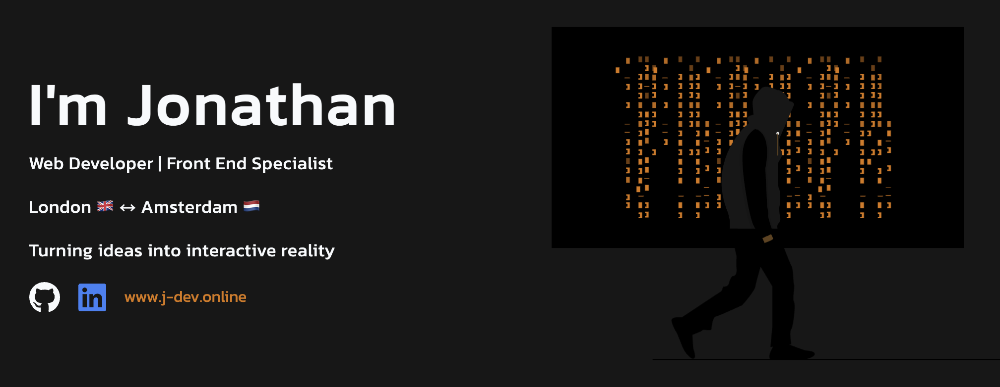

[Learn more about me](https://j-dev.online/#about)

---

## 💻 Tech Stack

&nbsp;
&nbsp;
&nbsp;
&nbsp;
&nbsp;
&nbsp;
&nbsp;

---

### What I'm passionate about 💪🏿

I specialize in crafting maintainable, scalable software solutions to simplify our developers' workflows. By prioritizing clean architecture and reusable components, I aim to optimize productivity and foster collaboration.

My goal is to empower teams to deliver exceptional results efficiently, ensuring our software evolves seamlessly with changing requirements.

### What I'm learning 🧠

[GenAI Essentials](https://app.exampro.co/student/journey/exp-genai-001)
